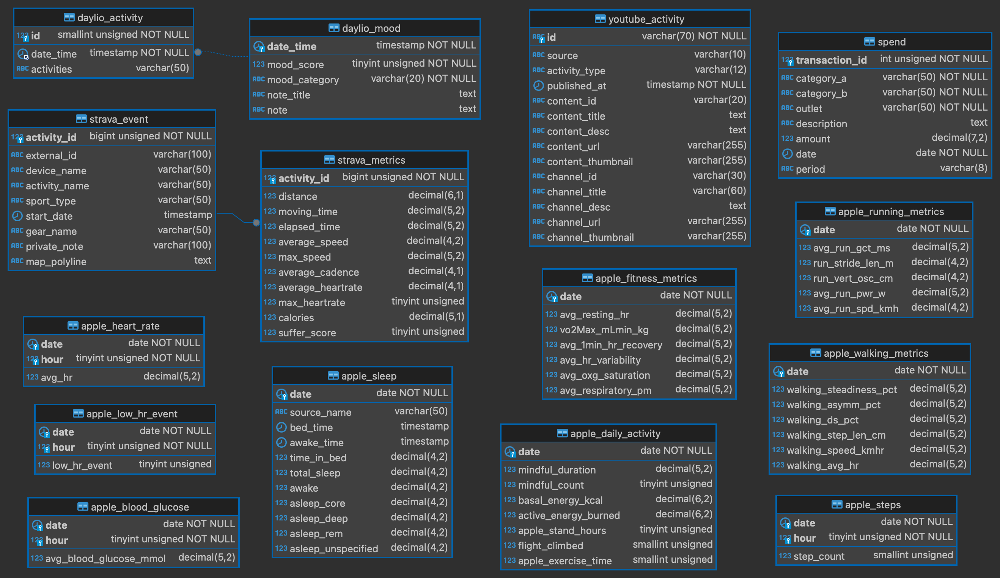
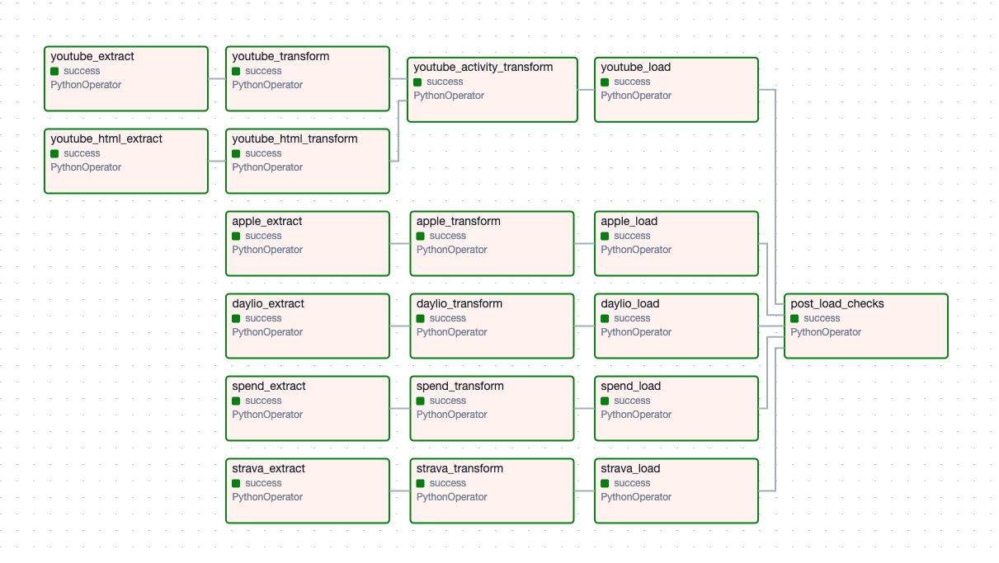

# Data Stream ETL

This repository contains a Python based ETL pipeline to centralise data from multiple sources into a structured database, enabling data analysis and application development. The project includes the use of Redis for caching, AWS S3 and MySQL for data storage and Airflow for scheduling and monitoring.

## Project Outline

- Establish a comprehensive personal data repository, laying the foundation for developing personalised applications and dashboards with the ability to query historical data.
- Utilise a range of technologies such as Python, MySQL, API integration, HTML scraping, Redis, S3, and Airflow.
- Implement diverse data extraction techniques such as API calls, HTML scraping, and manual exports.
- Design physical data models to store data in a structured format.
- Integrate data from various formats including CSV, JSON, XML into distinct MySQL tables.
- Develop a modular pipeline for scalable data integration and transformation.

### Data Sources

- **Apple Health**: Large XML file covering walking metrics, daily activity, blood glucose levels, heart rate, fitness metrics, heart rate metrics, running metrics, sleep analysis, steps, and more.
- **Strava**: JSON data covering performance metrics, sport types, equipment information, and activity details.
- **YouTube**: JSON data covering YouTube likes/dislikes, subscriptions, etc.
- **Daylio**: CSV data covering mood tracking, activities, and notes.
- **Spend**: CSV data covering 6+ years of financial transactions.

### Physical Data Model



## Project Architecture

- **Extractors**: Modules to retrieve data from various sources, including Redis for caching and S3 as a data lake.
- **Transformers**: Modules to clean, standardise, and manipulate the data format.
- **Loader**: Modules responsible for inserting the data into the MySQL database.
- **Utility**: Contains helper functions and classes for database interactions (`DatabaseHandler`) and file management (`FileManager`).
- **Validation**: Script for post-load data validation to ensure data integrity and consistency.

### Data Flow Diagram



## Requirements

- Python (version 3.12.3)
- MySQL (version 8.3.0)
- Redis (version 7.2.5)
- AWS S3
- Airflow (version 2.9.2)

## Setup Instructions

Clone the Repository:

```bash
git clone https://github.com/hawa1222/data-stream-etl.git
cd data-stream-etl
```

Set up Python environment:

``` bash
python3 -m venv .venv
source .venv/bin/activate
pip install -r requirements.txt
```

Set up MySQL:

- Install MySQL server and create a new database.
- Update the database connection details in the `config.py` file.

Set up Redis:

- Install Redis server and start the service.
- Update the Redis connection details in the `config.py` file.

Set up AWS S3:

- Create an AWS account and set up an S3 bucket.
- Update the AWS S3 connection details in the `config.py` file.

Set up Airflow:

- Installed in requirements.txt or install manually:

``` bash
pip install apache-airflow
```

- Initialise the Airflow database:

``` bash
airflow db migrate
```

- Create an Airflow user:

``` bash
airflow users create \
    --username admin \
    --firstname admin \
    --lastname admin \
    --role Admin \
    --email
```

- Start the Airflow web server:

``` bash
airflow webserver --port 8080
```

- Start the Airflow scheduler:

``` bash
airflow scheduler
```

- Access the Airflow web interface at `http://localhost:8080`.

Configure environment variables:

- Copy .env_template to .env
- Fill in all required variables in .env

## Usage

To execute the ETL process manually, run the following command in your terminal:

```bash
python main.py
```
